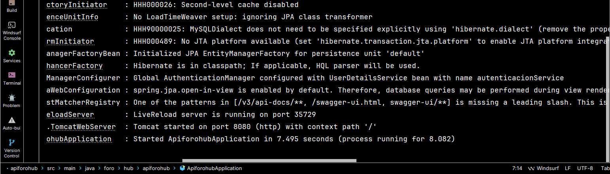
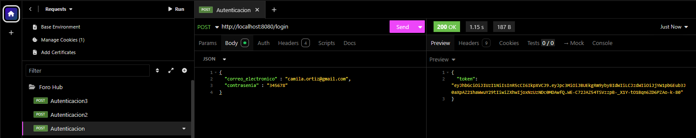

***
# <h1 align="center"> 💥Challenge Construcción del API REST Foro-Hub con Spring Boot 3 y SpringDoc💥 </h1>
***


## 📄Descripción del proyecto

```sh

Foro-Hub es una API RESTful desarrollada con Spring Boot 3, diseñada para gestionar un 
foro académico donde los usuarios pueden publicar temas de discusión (tópicos), responder 
a ellos y clasificarlos según su estado. El sistema incorpora autenticación mediante JWT, 
validaciones con Jakarta Bean Validation y documentación automática con SpringDoc y 
Swagger UI.

```

## 📃Objetivos del proyecto

```sh

- Diseñar e implementar una API robusta basada en principios REST para un foro de 
  discusión.
- Implementar autenticación y autorización segura.
- Incorporar seguridad a nivel de endpoints usando JWT y Spring Security.
- Gestionar entidades como tópicos, respuestas, cursos y usuarios.
- Implementar borrado lógico y control de versiones.
- Documentar automáticamente la API REST con SpringDoc.
- Manejo de errores personalizados y robustez ante fallos de red o de formato.
- Seguir las mejores prácticas de desarrollo con Spring Boot.

```

## 🧠 Objetivos de aprendizaje

```sh

- Comprender e implementar arquitectura REST con Spring Boot 3.
- Utilizar JPA con Hibernate para persistencia de datos en MySQL.
- Aprender a usar Spring Security y JWT para proteger APIs.
- Validación de datos con Bean Validation.
- Manejo de migraciones con Flyway.
- Manejar errores de forma centralizada con excepciones personalizadas.
- Documentar APIs con OpenAPI/Swagger (SpringDoc).
- Realizar testing básico con herramientas REST (Insomnia/Postman).
- Patrones de diseño y buenas prácticas.
- Practicar el uso de Git y GitHub para el control de versiones.

```

## 🛠️Recursos y herramientas utilizados

```sh

- Trello: para organizar las tareas y el progreso del proyecto.
- Discord: para comunicarse con los compañeros y aclarar dudas.
- Cursos y formaciones de Alura Latam: para consultar contenidos relevantes y obtener más 
  información.
- GitHub: para publicar y compartir el código del proyecto.
- LinkedIn: para conectarse con la comunidad y mostrar el aprendizaje adquirido.
- Chatgpt, DeepSeek para consultas y depuración de errores
- Spring Initializr(https://start.spring.io/)
- Sistema operativo Windows 11 pro 24H2

```

📂 Estructura del Proyecto

```sh
src/main/java/foro/hub/apiforohub/
├── controller/           # Controladores REST (autenticación, usuarios, cursos, tópicos, 
│                         # respuestas)
├── domain/               # Entidades y DTOs organizados por dominio y reglas de negocio
│   ├── curso/
│   ├── respuesta/
│   ├── topico/
│   └── usuario/
└── infra/                # Excepciones globales, Configuración de seguridad, documentación
│                         # Swagger,validaciones personalizadas y utilidades
│
└── resources/            # Migraciones, application.properties
│
└── target/               # apiforohub.jar
```

## 📗Funcionalidad Principal del Challenge Construcción del API REST Foro-Hub con Spring Boot 3 y SpringDoc

```sh

1. Registro de usuarios.

2. Autenticación con JWT.

3. Creación, listado, detalle, actualización y borrado lógico de:
   - Cursos.
   - Usuarios.
   - Tópicos.
   - Respuestas.

4. Gestión del estado de los tópicos (NO_RESPONDIDO, NO_SOLUCIONADO, SOLUCIONADO, CERRADO).

5. Validaciones automáticas de entradas con @Valid.

6. Seguridad en endpoints (usuarios autenticados pueden crear,listar actualizar, borrar o 
   responder tópicos).

7. Documentación interactiva de la API vía Swagger UI (http://localhost:8080/swagger-ui/index.html)

```

## 🔄 Flujo de Trabajo Típico

```sh
   1. Registrar un nuevo usuario o iniciar sesión
   2. Obtener token JWT
   3. Usar el token en el header Authorization: Bearer <token>
   4. Interactuar con los endpoints protegidos según los permisos

```

## 🧱Tecnologías Utilizadas

✔️☕ Oracle Java OpenJDK 21.0.6 Lenguaje principal del proyecto

✔️🛠️ IntelliJ IDEA 2025 1.2 Entorno de desarrollo (IDE)

✔️☕ MySQL 9.3 Sistema de base de datos utilizado

✔️🌐 Spring Boot 3.4.7 [Spring Initializr](https://start.spring.io/) Framework para estructurar 
      el proyecto

✔️📦 Spring Security

✔️📦 JWT(JSON Web Tokens) para autenticación

✔️📦 SpringDoc OpenAPI 2.7.0 para documentación

✔️📦 Flyway para migraciones de base de datos

✔️📦 Lombok para simplificación de código

✔️📦 Jakarta Validation para validaciones automáticas

✔️📦 JPA/Hibernate como ORM

✔️📦 Maven (gestión de dependencias con pom.xml)

✔️📦 Spring Boot DevTools para desarrollo

✔️📦 Insomnia 11.2.0 para pruebas de de endpoints

## 💾 Base de datos (nombre: forohub)

```sh

✔️✅ Sistema de gestión: MySQL v9.3.

✔️✅ Tablas principales:
        - usuarios (campos: id, nombre, email, contraseña, activo). Evita duplicados 
          verificando por email antes de insertar.

        - cursos (campos: id, nombre, categoria, activo). Evita duplicados 
          verificando por nombre antes de insertar. 

        - topicos (campos: id, titulo, mensaje, fecha_creacion, status, autor_id, curso_id, 
          activo). Evita duplicados verificando por titulo y mensaje antes de insertar. 

        - respuestas (campos: id, mensaje, topico_id, fecha_creacion, autor_id,  solucion). 
          Evita duplicados verificando por mensaje y topico y autor antes de insertar.

✔️✅ Uso de claves foráneas y borrado en cascada.

✔️✅ Campo activo en entidades para manejo de borrado lógico.

✔️✅ Scripts SQL disponibles para creación por migraciones.

```

## 🔒 Seguridad

✔️✅ Spring Security configurado con filtros personalizados.

✔️✅ Autenticación mediante JWT, con endpoint de login (/login).

✔️✅ Endpoints públicos: autenticación.

✔️✅ Endpoint privado: todos los demás.

✔️✅ Contraseñas almacenadas con BCrypt

✔️✅ Protección contra CSRF deshabilitada para API REST

✔️✅ Configuración CORS personalizada

✔️✅ Manejo centralizado de excepciones

## 📝 Endpoints Principales

```sh

✔️✅ Autenticación: 
      - POST /login - Autenticación de usuario

✔️✅ Usuarios: 
      - POST /usuarios  Registrar nuevo usuario 
      - GET /usuarios  Listar usuarios
      - GET /usuarios/{id}  Obtener usuario por ID
      - PUT /usuarios/{id}  Actualizar usuario autenticado
      - PUT /usuarios/{id}/contrasenia  Actualizar contraseña de usuario autenticado con BCrypt
      - DELETE /usuarios/{id}  Eliminar usuario autenticado lógicamente

✔️✅ Cursos: 
      - POST /cursos  Registrar nuevo curso
      - GET /cursos  Listar cursos

✔️✅ Topicos: 
      - POST /topicos  Registrar nuevo topico
      - GET /topicos  Listar topicos
      - GET /topicos/{id}  Obtener topico por ID
      - PUT /topicos/{id}  Actualizar topico
      - DELETE /topicos/{id}  Eliminar topico lógicamente

✔️✅ Respuestas: 
      - POST /respuestas  Registrar nueva respuesta
      - GET /respuestas  Listar respuestas
      - GET /respuestas/{id}  Obtener respuesta por ID
      - PUT /respuestas/{id}  Actualizar respuesta

```

## 📖 Documentación de API

✔️✅ SpringDoc habilitado con Swagger UI.

✔️✅ [Documentación automática con OpenAPI/Swagger. (http://localhost:8080/swagger-ui/index.html)](http://localhost:8080/swagger-ui/index.html)

✔️✅ OpenAPI configurado para mostrar rutas protegidas y públicas

✔️✅ Esquema OpenAPI: /v3/api-docs

## 🧪 Testing y Pruebas

✔️✅ Pruebas manuales realizadas con Insomnia (cuerpo, headers y tokens).

✔️✅ Manejo de errores HTTP personalizado y en español.

## 📌 Consideraciones Adicionales

✔️✅ Uso de record para DTOs inmutables y compactos.

✔️✅ Uso de anotaciones de validación como @NotBlank, @Email, etc.

✔️✅ Diseño limpio con separación de capas.

✔️✅ Gestión de errores centralizada y mensajes amigables en español.

✔️✅ Control de acceso a través de filtros JWT implementados manualmente.

✔️✅ Preparado para escalar a versiones posteriores con facilidad.

## 🙏Contribuciones

>> Si deseas contribuir al proyecto, siéntete libre de hacer un fork del repositorio y enviar un pull request con tus mejoras o sugerencias.

## 🔆Resultados del Challenge Construcción del API REST Foro-Hub con Spring Boot 3 y SpringDoc

>> 

>> 

>> 

>> 

>> 

>> 

>> 

>> 

>> 

>> 

>> 

>> 

>> 

>> 

>> 

>> 

>> 

>> 

>> 

>> 

>> 

>> 

>> 

>> 

>> 

>> 

>> 

>> 

>> 

>> 

>> 

>> 

>> 

>> 

>> 

>> 

>> 

>> 

>> 

>> 

>> 

>> 

>> 

>> 

>> 

>> 

>> 

>> 

>> 

>> 

>> 

>> 

>> 

>> 

>> 

>> 

>> 

>> 

>> 

>> 

>> 

>> 

>> 

>> 

>> 

>> 

>> 

>> 

>> 

>> 

>> 

>> 

## 👩👨Autores del Proyecto

>>     Programación Spring Boot 3.4.7, SpringDoc y Spring Security
>                               
>>>   Desafio puesto

🏆Insignias ganadas

>>     Cuarta insignia ganada

## 📜Certificado


